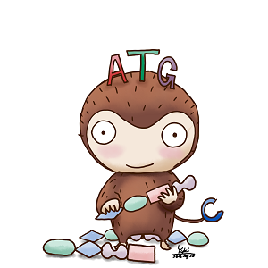

.. genomon documentation master file, created by
   sphinx-quickstart on Thu Jul 30 15:55:28 2015.
   You can adapt this file completely to your liking, but it should at least
   contain the root `toctree` directive.

.. image:: https://img.shields.io/badge/python-2.7-blue.svg
    :target: https://img.shields.io/badge/python-2.7-blue.svg
.. image:: https://img.shields.io/badge/license-GPL--3-blue.svg
    :target: https://img.shields.io/badge/license-GPL--3-blue.svg

.. image:: image/genomon_logo.png

—The Zen of Cancer Genome Sequence Analysis—
---------------------------------------------

:Author: Kenichi Chiba, Eigo Shimizu and Yuichi Shiraishi
:Date: |today|
:Version: v2.2.0

.. toctree::
   :maxdepth: 2
   :caption: Install Documentation

   install.rst

.. toctree::
   :maxdepth: 2
   :caption: DNA Analysis Documentation
   
   dna_quick_start.rst
   dna_workflow.rst
   dna_sample_csv.rst
   dna_command.rst
   dna_output_info.rst
   dna_results.rst
   dna_config_info.rst
   
.. toctree::
   :maxdepth: 2
   :caption: RNA Analysis Documentation
   
   rna_quick_start.rst
   rna_workflow.rst
   rna_sample_csv.rst
   rna_command.rst
   rna_output_info.rst
   rna_results.rst
   rna_config_info.rst

